# Maccabi Clicks EHR Integration — Technical Specification Document

**Prepared by:** Dr. Rami Khouri, CMIO — Taliaz Health / HealthyMind Clinic
**Date:** March 19, 2026
**Version:** 1.0
**Classification:** Confidential — For Maccabi Technical Team
**Recipients:** Shlomi (Maccabi Tech Lead), Maccabi Architect Team

---

## 1. Executive Summary

This document describes the current end-to-end workflow performed by Taliaz/HealthyMind psychiatrists within **Maccabi's Clicks EHR system** (W-Clicks Dot.NET, Version 2023.12.109.23696). It maps every screen, field, and interaction required during a psychiatric consultation — from patient lookup to prescription issuance — to enable Maccabi's architecture team to assess **API integration feasibility**.

**Goal:** Replace manual Clicks data entry with automated API calls from Taliaz's clinical platform (Predictix/Xano), enabling:
1. **Automated summary upload** (תשובת יועץ) from Taliaz to Clicks
2. **Prescription issuance** via API instead of manual entry
3. **Bidirectional data sync** — pulling patient demographics, medications, and lab results into Taliaz

**Current system versions observed:**
- W-Clicks Dot.NET | Version 2023.12.109.23696
- Application version 2024.09.101
- Accessed via Citrix StoreFront at `d.mac.org.il/Citrix/ExtWeb/`

---

## 2. System Architecture Overview

```
┌─────────────────────────────────────────────────────────────────┐
│                        CURRENT STATE                            │
│                                                                 │
│  ┌──────────────┐    Citrix VPN    ┌──────────────────────┐     │
│  │  Psychiatrist │ ──────────────► │  Clicks EHR          │     │
│  │  (Local PC)   │                 │  (Maccabi Servers)   │     │
│  └──────┬───────┘                  └──────────────────────┘     │
│         │                                                       │
│         │ Copy-paste                                            │
│         ▼                                                       │
│  ┌──────────────┐                                               │
│  │  Predictix   │  Taliaz clinical platform                     │
│  │  (Xano/Web)  │  Summary generation, patient management      │
│  └──────────────┘                                               │
└─────────────────────────────────────────────────────────────────┘

┌─────────────────────────────────────────────────────────────────┐
│                        TARGET STATE                             │
│                                                                 │
│  ┌──────────────┐    API Layer     ┌──────────────────────┐     │
│  │  Predictix   │ ◄─────────────► │  Clicks EHR          │     │
│  │  (Xano/Web)  │   (REST/SOAP)   │  (Maccabi Servers)   │     │
│  └──────────────┘                  └──────────────────────┘     │
│         │                                    │                  │
│         └────── Automated flow ──────────────┘                  │
│           - Summary upload                                      │
│           - Prescription sync                                   │
│           - Patient data pull                                   │
└─────────────────────────────────────────────────────────────────┘
```

---

## 3. Complete Workflow — Screen-by-Screen Documentation

### 3.1 Access & Authentication

#### Step 1: Citrix StoreFront Launch
**Screenshot:** `01_citrix_storefront_app_launcher.jpg`

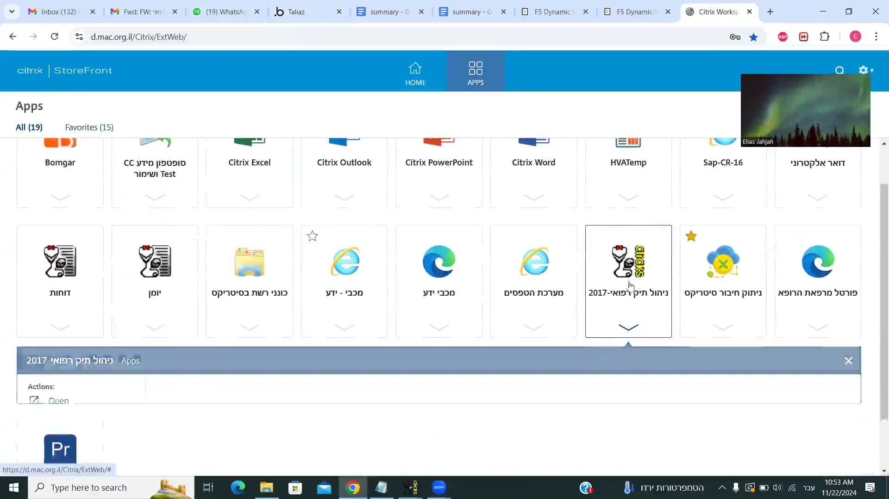

The psychiatrist accesses Clicks via Maccabi's Citrix StoreFront portal at `d.mac.org.il/Citrix/ExtWeb/`. The portal shows 19 available apps including:
- **ניהול תיק רפואי-2017** (Medical Records Management) — This is the Clicks application
- Citrix Excel, Word, PowerPoint, Outlook
- Bomgar (remote support)
- Various Maccabi portals

**Integration note:** The Citrix layer adds complexity — any API would need to bypass the Citrix session or operate server-side within Maccabi's network.

---

### 3.2 Doctor Portal & Patient Selection

#### Step 2: Clicks Doctor Portal (פורטל רופא)
**Screenshot:** `02_clicks_doctor_portal_patient_list.jpg`

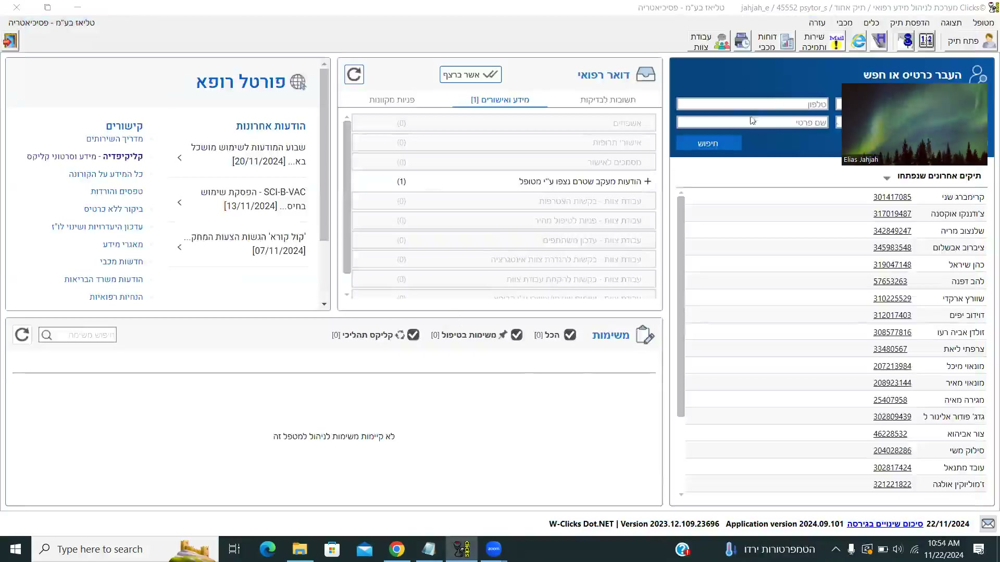

After launch, the doctor enters the **Clicks Doctor Portal** (פורטל רופא). Key areas visible:

**Left panel — Links (קישורים):**
- מדריך השירותים (Services guide)
- קליקיפדיה (Clickipedia — internal knowledge base)
- כל המידע על הקורונה (COVID info)
- טפסים והורדות (Forms & downloads)
- ביקור ללא כרטיס (Visit without card)
- עדכון היעדרויות ושינוי ל"ז (Absence/schedule updates)
- מאגרי מידע (Data sources)
- חדשות מכבי (Maccabi news)
- הודעות משרד הבריאות (Ministry of Health notices)
- הנחיות רפואיות (Medical guidelines)

**Center — Medical mail (דואר רפואי), tasks, and messages:**
- תשובות לבדיקות (Lab results responses)
- מידע ואישורים (Information & approvals)
- פניות מקומות (Location requests)
- אישורי תרופות (Medication approvals)
- מסמכים לאישור (Documents for approval)
- הודעות מעקב (Follow-up messages)

**Right panel — Patient search (העבר כרטיס או חפש):**
- Search by phone number, ID number (ת.ז.), first name, family name
- Options: ביקור ללא מטופל (Visit without patient), קריאה בלבד (Read-only)
- **Recently opened files** list with patient names and ID numbers

**Bottom bar — Task tabs:**
- משימות (Tasks)
- משימות בטיפול (Tasks in treatment)
- קליקס תהליכי (Clicks workflows)

**Data fields for API:**
| Field | Hebrew | Type | Notes |
|-------|--------|------|-------|
| Patient ID (ת.ז.) | תעודת זהות | 9-digit number | Primary key |
| Phone | טלפון | String | |
| First name | שם פרטי | String | |
| Family name | שם משפחה | String | |

---

#### Step 3: Parallel View — Clicks + Taliaz Predictix
**Screenshot:** `03_clicks_and_predictix_side_by_side.jpg`

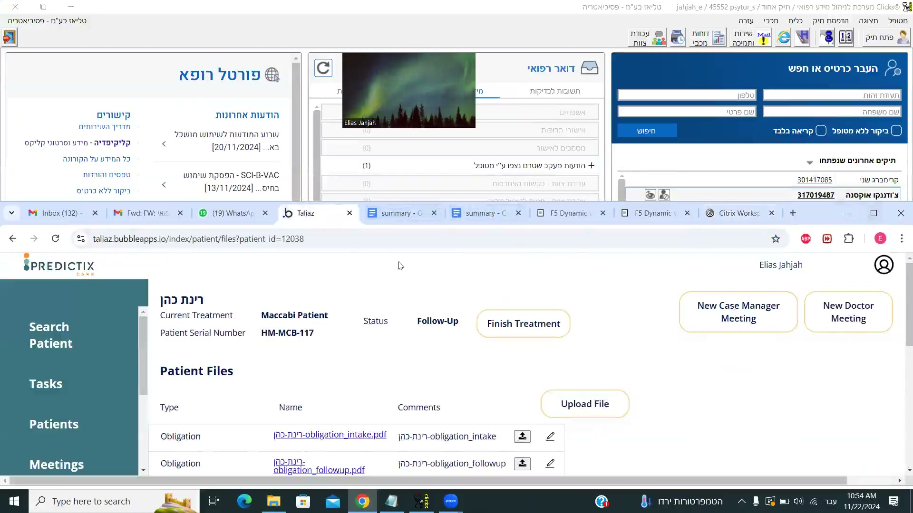

The psychiatrist works with **both systems open simultaneously:**
- **Top half:** Clicks EHR (patient file, medical mail)
- **Bottom half:** Taliaz Predictix platform (`taliaz.bubbleapps.io/index/patient/files?patient_id=12038`)

The Predictix system shows:
- Patient name: רינת כהן
- Current Treatment: **Maccabi Patient**
- Status: **Follow-Up**
- Patient Serial Number: **HM-MCB-117**
- Buttons: New Case Manager Meeting, New Doctor Meeting, Finish Treatment
- Patient Files section with uploaded obligation documents

**Integration opportunity:** Eliminate the copy-paste between these two systems by having Predictix push/pull data to/from Clicks via API.

---

### 3.3 Patient File & Clinical Data

#### Step 4: Patient Personal Details (פרטים אישיים)
**Screenshot:** `04_patient_file_personal_details.jpg`

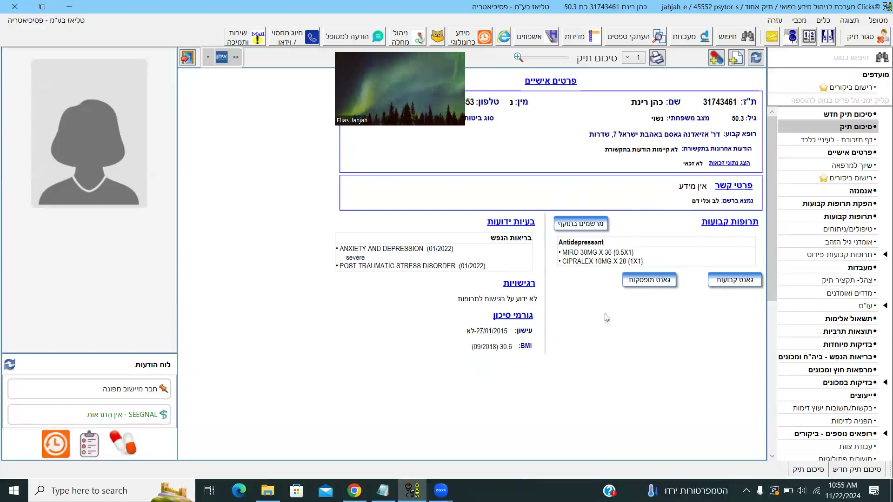

Once a patient is selected, the full patient file opens in Clicks showing:

**Header bar:** Patient name, ID, age, gender
- ת.ז.: 31743461
- שם: כהן רינת
- מין: נ (Female)
- גיל: 50.3
- מצב משפחתי: נשוי (Married)

**Clinical summary visible:**
- רופא קבוע: ד"ר אזיאדנה גאסם (Primary physician)
- הודעות אחרונות במקושרת: לא קיימות (No linked messages)

**Contact info section (פרטי קשר):**
- נמצא ברשם: לב וכלי דם (Listed in: Cardiovascular registry)

**Known problems (בעיות ידועות) — Mental health section (בריאות הנפש):**
- ANXIETY AND DEPRESSION (01/2022) — severe
- POST TRAUMATIC STRESS DISORDER (01/2022)

**Current medications (תרופות קבועות) with active prescriptions (מרשמים בתוקף):**
- Antidepressant category:
  - MIRO 30MG X 30 (0.5X1) — Mirtazapine
  - CIPRALEX 10MG X 28 (1X1) — Escitalopram

**Risk factors (גורמי סיכון):**
- עישון (Smoking): 27/01/2015
- BMI: 30.6 (09/2018)

**Right sidebar navigation — Full menu tree:**
- סיכום תיק חדש / סיכום תיק (File summary)
- דף תזכורת (Reminder page)
- פרטים אישיים (Personal details)
- שיוך למרפאה (Clinic assignment)
- רישום ביקורים (Visit registration) ← Yellow star = active visits
- אנמנה (Anamnesis)
- הפקת תרופות קבועות (Generate chronic prescriptions)
- תרופות קבועות (Chronic medications)
- טיפולים/ניתוחים (Treatments/surgeries)
- מעבדות (Lab results)
- תשאול אלימות (Violence screening)
- תוצאות תרביות (Culture results)
- בדיקות מיוחדות (Special tests)
- בריאות הנפש - ביה"ח וסכנים (Mental health - hospitals & risks)
- מרפאות חוץ וסכנים (Outpatient & risks)
- ייעוצים (Consultations)
- רופאים נוספים - ביקורים (Other doctors - visits)
- עבודת צוות (Team work)

**Data fields for API — READ operations:**
| Field | Hebrew | API Priority |
|-------|--------|-------------|
| Patient demographics | פרטים אישיים | HIGH |
| Known diagnoses | בעיות ידועות | HIGH |
| Current medications | תרופות קבועות | HIGH |
| Allergies/sensitivities | רגישויות | HIGH |
| Lab results | מעבדות | MEDIUM |
| Risk factors | גורמי סיכון | MEDIUM |
| Previous consultations | ייעוצים | MEDIUM |
| Primary physician | רופא קבוע | LOW |

---

### 3.4 Visit Registration

#### Step 5: Opening a Visit (רישום ביקורים)
**Screenshot:** `05_visit_registration_screen.jpg`

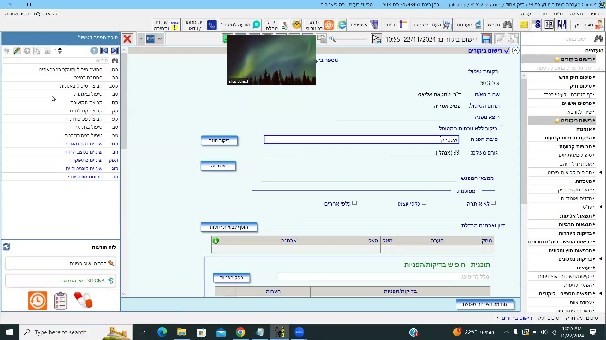

The visit registration screen captures:

**Visit metadata:**
- Date/time: 10:55 22/11/2024
- Doctor: ד"ר ג'הג'אה אלי'אס (Dr. Jahjah Elias)
- Specialty: פסיכיאטריה (Psychiatry)
- Treatment period: (treatment period field)
- Age: 50.3

**Visit type options:**
- ביקור ללא נכחות המטופל (Visit without patient presence) ☑
- ביקור חוזר (Return visit) / אינטייק (Intake)
- סיבת הפניה (Referral reason)
- גורם משלם: 99 (מנהלי) — Paying entity: 99 (Administrative)

**Clinical findings section (ממצאי הבדיקה):**
- Free text field for examination findings
- Dangerousness checkboxes: לא אותרה (Not identified), כלפי עצמו (Self-harm), כלפי אחרים (Toward others)

**Diagnosis section (דיון ואבחנה מבדלת):**
- הוסף לבעיות ידועות (Add to known problems) button
- Diagnosis table: מחק (Delete) | הערה (Note) | מאפ (Map) | מאפ (Map) | אבחנה (Diagnosis)

**Referrals section (תוכנית - חיפוש בדיקות/הפניות):**
- Search for tests and referrals
- הפק הפניות (Generate referrals) button

**Bottom action buttons:**
- טפסים מועדפים (Preferred forms)
- חידוש טפסים (Renew forms)
- סיכום שינוי סטטוס (Status change summary)

**Left sidebar — Visit type codes:**
- Various visit types with abbreviations (מל, כמ, בט, etc.)
- Including: רמת תפקוד שכלי (Intellectual function level), שיפוט רפואי ומשאלות (Medical judgment), etc.

**Data fields for API — WRITE operations:**
| Field | Hebrew | Type | API Priority |
|-------|--------|------|-------------|
| Visit date/time | תאריך ושעה | DateTime | HIGH |
| Doctor ID | מזהה רופא | String | HIGH |
| Visit type | סוג ביקור | Enum (Intake/Follow-up) | HIGH |
| Clinical findings | ממצאי הבדיקה | Free text | HIGH |
| Dangerousness assessment | מסוכנות | Checkboxes | HIGH |
| Referral reason | סיבת הפניה | String | MEDIUM |

---

#### Step 6: Clinical Findings Entry
**Screenshot:** `06_clinical_findings_form.jpg`

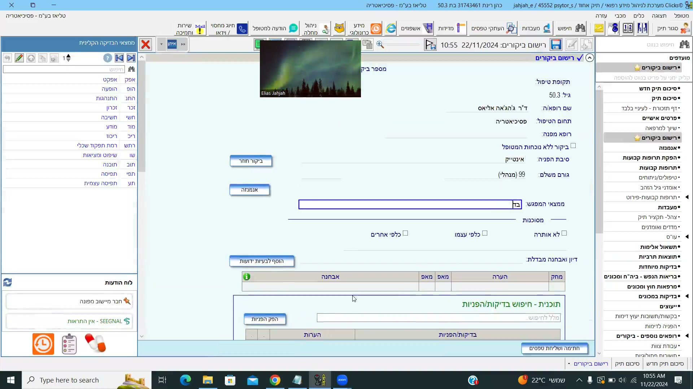

The clinical findings form showing the same visit registration with the cursor in the findings field. The left sidebar shows the **clinical examination categories** (ממצאי הבדיקה הקלינית):
- אפקט (Affect)
- הופעה (Appearance)
- חוף (Body)
- התנהגות (Behavior)
- דבר / זכרון (Speech/Memory)
- חוטי (Thread of thought)
- תהליך מחשבה (Thought process)
- רמת תפקוד שכלי (Intellectual functioning)
- שיפוט רפואי ומשאלות (Medical judgment)
- שינויים במצב הרוח (Mood changes)
- שינויים בהתנהגות (Behavioral changes)
- שינויים בתיפקוד (Functional changes)
- תלונות סומטיות (Somatic complaints)

---

### 3.5 Diagnosis Entry

#### Step 7: ICD Diagnosis Search & Selection
**Screenshot:** `07_diagnosis_icd_entry.jpg`

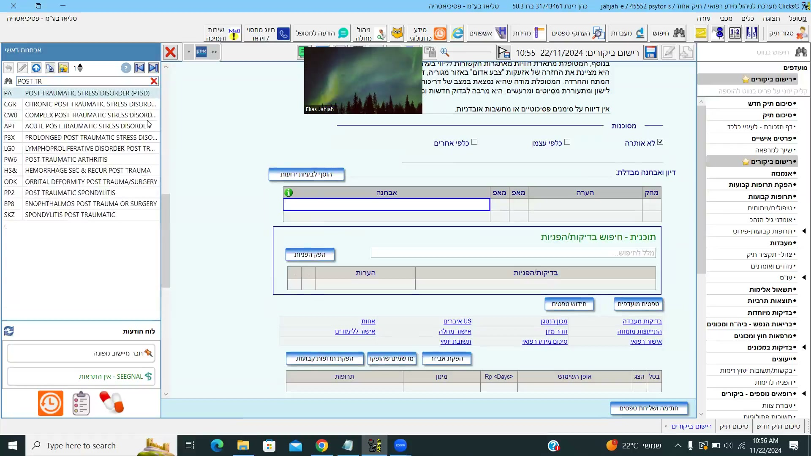

The diagnosis autocomplete field showing ICD codes. Searching "POST TR" returns:
- **PA** — POST TRAUMATIC STRESS DISORDER (PTSD)
- CGR — CHRONIC POST TRAUMATIC STRESS DISORDER
- CW0 — COMPLEX POST TRAUMATIC STRESS DISORDER
- APT — ACUTE POST TRAUMATIC STRESS DISORDER
- P3X — PROLONGED POST TRAUMATIC STRESS DISORDER
- LG0 — LYMPHOPROLIFERATIVE DISORDER POST TR...
- PW6 — POST TRAUMATIC ARTHRITIS
- HS& — HEMORRHAGE SEC & RECUR POST TRAUMA
- ODK — ORBITAL DEFORMITY POST TRAUMA/SURGERY
- PP2 — POST TRAUMATIC SPONDYLITIS
- EP8 — ENOPHTHALMOS POST TRAUMA OR SURGERY
- SKZ — SPONDYLITIS POST TRAUMATIC

**Bottom section shows treatment plan fields:**
- טפסים מועדפים (Preferred forms)
- חידוש טפסים (Renew forms)
- Various action buttons: אמות (Authentication), גלו ארכיבים (Archive browsing), אישור פריטים (Item approval), מוכן רפיון (Ready for referral), חולה רכישה (Patient procurement), הנפקת שניים (Duplicate issuance), אישור מותג (Brand approval)

**Data fields for API — Diagnosis WRITE:**
| Field | Type | Notes |
|-------|------|-------|
| Diagnosis code | ICD-10 code string (e.g., "PA") | Clicks uses internal short codes mapped to ICD |
| Diagnosis text | Free text | Full diagnosis name |
| Add to known problems | Boolean | הוסף לבעיות ידועות |

---

#### Step 8: Treatment Type Selection (Psychiatric Codes)
**Screenshot:** `08_treatment_type_psychiatric_codes.jpg`

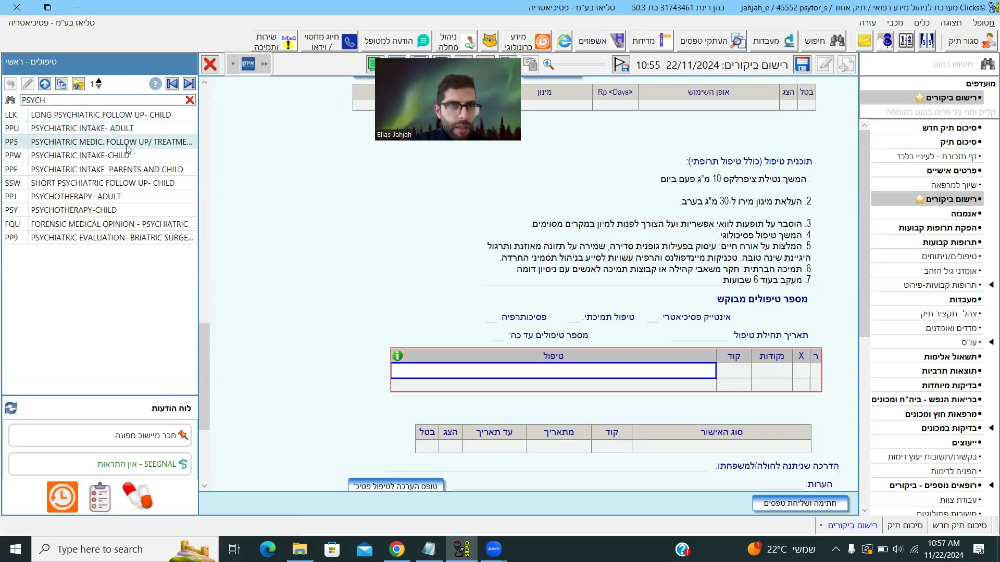

Searching "PSYCH" in the treatment type dropdown reveals the psychiatric service codes:

| Code | Description |
|------|-------------|
| LLK | LONG PSYCHIATRIC FOLLOW UP - CHILD |
| PPU | PSYCHIATRIC INTAKE - ADULT |
| PP5 | PSYCHIATRIC MEDIC. FOLLOW UP / TREATMENT |
| PPW | PSYCHIATRIC INTAKE - CHILD |
| PPF | PSYCHIATRIC INTAKE PARENTS AND CHILD |
| SSW | SHORT PSYCHIATRIC FOLLOW UP - CHILD |
| PP1 | PSYCHOTHERAPY - ADULT |
| PSV | PSYCHOTHERAPY - CHILD |
| FQU | FORENSIC MEDICAL OPINION - PSYCHIATRIC |
| PP9 | PSYCHIATRIC EVALUATION - BRIATRIC SURGERY |

**The visible treatment plan section shows:**
- תוכנית טיפול (כולל טיפול תרופתי) — Treatment plan (including pharmacological)
- Free text treatment recommendations already entered:
  1. המשך נטילת ציפרלקס 10 מ"ג פעם ביום (Continue Cipralex 10mg daily)
  2. העלאת מינון מירו ל-30 מ"ג בערב (Increase Miro to 30mg evening)
  3-7. Additional clinical recommendations

**Data fields for API — Treatment WRITE:**
| Field | Type | Notes |
|-------|------|-------|
| Treatment code | String (e.g., "PPU") | Maccabi service code |
| Treatment plan text | Free text | Multi-line clinical recommendations |
| Number of treatments requested | Integer | מספר טיפולים מבוקש |
| Treatment start date | Date | תאריך התחלת טיפול |

---

### 3.6 Consultant Response Letter (תשובת יועץ)

#### Step 9: Selecting the Referring Doctor
**Screenshot:** `09_consultant_response_doctor_selection.jpg`

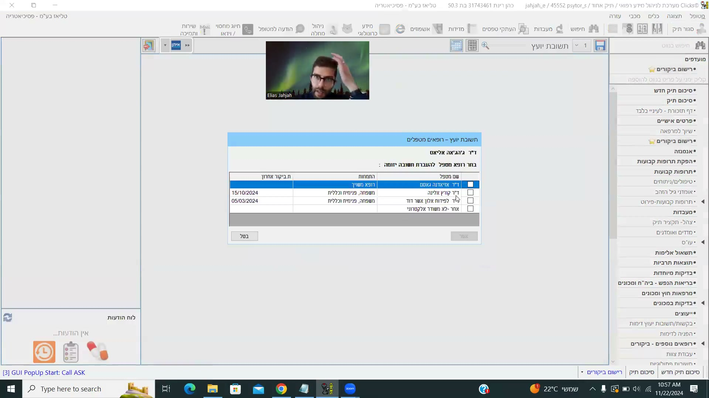

The consultant response (תשובת יועץ) dialog showing:
- **Header:** תשובת יועץ – רופאים מטפלים (Consultant response – Treating physicians)
- **Doctor:** ד"ר ג'הג'אה אלי'אס
- **Instruction:** בחר רופא מטפל להעברת תשובה יזומה (Select treating physician for proactive response transfer)

**Referring physician table:**
| שם מטפל | התמחות | ת.ביקור אחרון | רופא משויך |
|---------|--------|--------------|------------|
| ד"ר אזיאדנה גאסם | - | - | ☑ (Primary) |
| ד"ר קורץ אלינע | משפחה, פנימית וכללית | 15/10/2024 | ☐ |
| ד"ר לפידות אלון אשר דוד | משפחה, פנימית וכללית | 05/03/2024 | ☐ |
| אחר - לא משודר אלקטרוני | - | - | ☐ |

**Integration note:** The response letter is currently the **primary mechanism** for communicating psychiatric findings back to the referring family doctor. This is the **#1 target for API automation** — pushing the summary from Taliaz directly into this field.

---

#### Step 10: Consultant Response Letter Content
**Screenshot:** `10_consultant_response_letter_content.jpg`

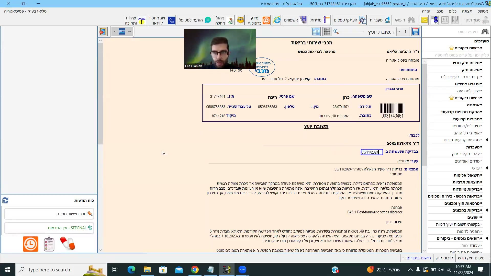

The full consultant response (תשובת יועץ) form:

**Header section:**
- מכבי שירותי בריאות (Maccabi Health Services)
- ד"ר ג'הג'אה אלי'אס
- מומחה בפסיכיאטריה (Specialist in Psychiatry)
- התמחות: (Specialization)
- פרטי הרופא (Doctor details)
- כתובת: קויפמן יהושקאל 2, תל אביב-יפו (Address)

**Patient details table:**
| Field | Value |
|-------|-------|
| שם פרטי | רינת |
| שם משפחה | כהן |
| ת.ז. | 31743461 |
| טלפון | 0506756853 |
| מין | נ |
| ת.לידה | 28/07/1974 |
| מיקוד | 8711218 |
| סל.גבורדהייס | 0506756853 |

**Response body:**
- תשובת יועץ (Consultant response heading)
- בדיקה שנעשתה ב: 05/11/2024 (Examination date)
- ד"ר דף סעיד חלאילה תאריך: 05/11/2024
- עקב: אינטייק (Reason: Intake)

**Clinical text content** (free text summary of the psychiatric assessment):
Full narrative including patient history, current symptoms, diagnosis, and treatment recommendations.

**Diagnosis field:**
- אבחנה: F43.1 Post-traumatic stress disorder
- סיכום ודיון (Summary and discussion)

**Data fields for API — Summary WRITE (HIGHEST PRIORITY):**
| Field | Type | Notes |
|-------|------|-------|
| Examination date | Date | בדיקה שנעשתה ב |
| Visit type | String | אינטייק / מעקב |
| Clinical narrative | RTF/HTML | Full assessment text |
| Diagnosis | ICD-10 + text | F43.1 Post-traumatic stress disorder |
| Treatment recommendations | Text | תרופות שינוי / תרופות מומלצות |
| Referring physician ID | String | Target for the response |

---

#### Step 11: Summary with Diagnosis & Recommendations
**Screenshot:** `11_summary_diagnosis_recommendations.jpg`

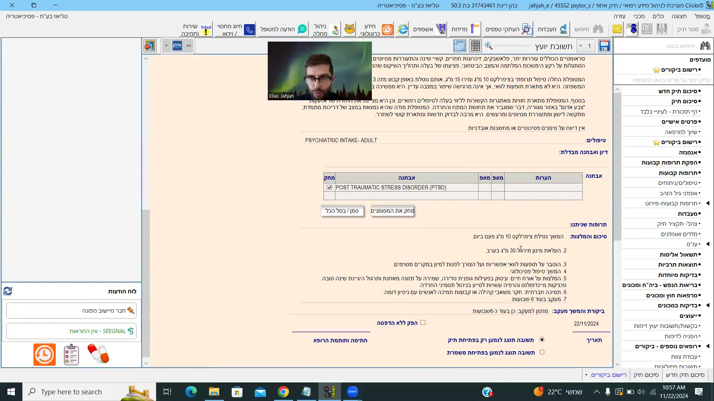

The lower portion of the consultant response showing:

**Diagnosis confirmation section (דיון ואבחנה מבדלת):**
- ☑ POST TRAUMATIC STRESS DISORDER (PTSD) — confirmed diagnosis
- שים/בטל הכל (Select/deselect all) buttons

**Medication changes (תרופות שינוי):**
- Listed as free text recommendations

**Signature section:**
- הפק ללא הדפסה (Generate without printing) checkbox
- Date: 22/11/2024
- חתימה: תשובה חוצה למנוע בפתיחת תיק (Signature: Response crosses to prevent file opening)
- תשובה חוצה למנוע בפתיחת משמרת (Response crosses to prevent shift opening)

---

### 3.7 Visit Completion & Signing

#### Step 12: Treatment Code & Follow-up Scheduling
**Screenshot:** `12_visit_completion_treatment_code.jpg`

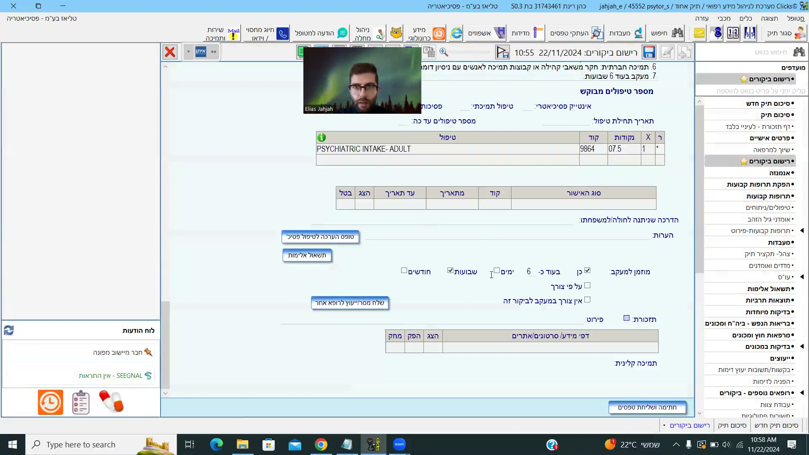

The completed visit form showing all treatment details:

**Treatment code entered:**
- טיפול: PSYCHIATRIC INTAKE - ADULT
- קוד: 9864
- נקודות: 07.5
- X: 1

**Follow-up scheduling:**
- מוזמן למעקב: כן ☑ (Scheduled for follow-up: Yes)
- בעוד 6 שבועות ☑ (In 6 weeks)
- Options: ימים/שבועות/חודשים (Days/weeks/months)

**Additional buttons:**
- טופס הערכה לטיפול פסיכ' (Psychological treatment evaluation form)
- תשאול אלימות (Violence questionnaire)
- שלח מסר/ייעוץ לרופא אחר (Send message/consult to other doctor)

**Information sheets section:**
- דפי מידע/סרטונים/אתרים (Info sheets/videos/websites)

**Data fields for API — Visit completion WRITE:**
| Field | Type | Notes |
|-------|------|-------|
| Treatment code | Integer (9864) | PSYCHIATRIC INTAKE - ADULT |
| Points | Decimal (07.5) | Service points |
| Follow-up interval | Integer + Unit | e.g., 6 weeks |
| Forms completed | Array of form IDs | Evaluation forms |

---

#### Step 13: Form Submission & Patient Instructions
**Screenshot:** `13_form_submission_patient_instructions.jpg`

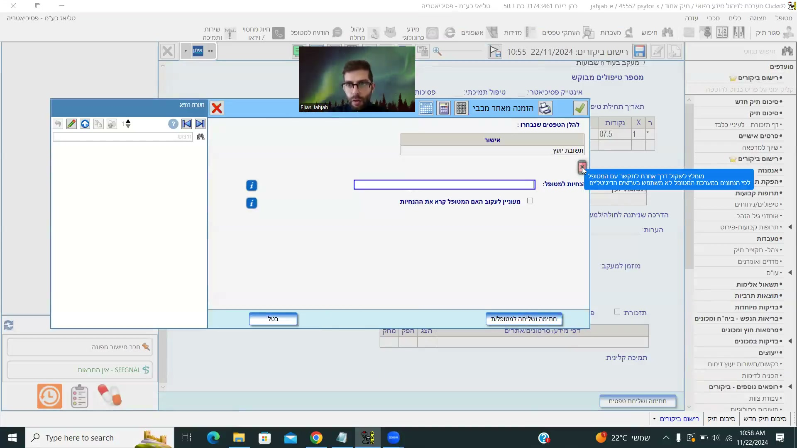

The submission dialog showing:

**Selected forms for printing (להלן הטפסים שנבחרו):**
- ☑ אישור (Approval form)
- ☑ תשובת יועץ (Consultant response)

**Patient instructions field (הנחיות למטופל):**
- Empty text field for free-text patient instructions
- Note: "מומלץ לשקול דרך אחרת לתקשר עם המטופל" (Recommended to consider alternative contact with patient)
- "לפי התיעוד במערכת המטופל לא משתמש בערוצים הדיגיטלים" (Per records, patient doesn't use digital channels)

**Checkbox:** מעוניין לעקוב האם המטופל קרא את ההנחיות (Interested to track if patient read instructions)

**Action buttons:**
- ביטול (Cancel)
- חתימה ושליחה למטופל/ת (Sign and send to patient)

---

#### Step 14: Digital Signature
**Screenshot:** `14_digital_signature_login.jpg`

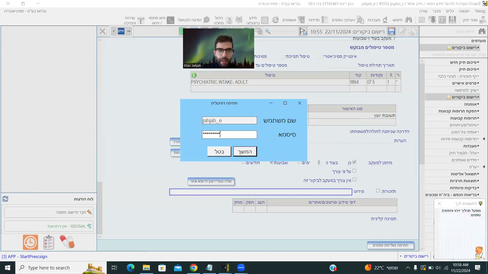

The digital signature dialog requires:
- שם משתמש (Username): jahjah_e
- סיסמא (Password): ********
- המשך (Continue) / ביטול (Cancel) buttons

**Status bar note:** "מופעל תהליך זיהוי וחתימת טפסים" (Form identification and signature process activated)

**Integration note:** Digital signatures are a critical security layer. Any API integration would need to handle authentication and signing programmatically, likely requiring a service account or certificate-based auth.

---

#### Step 15: Signed Visit Record
**Screenshot:** `15_signed_visit_record.jpg`

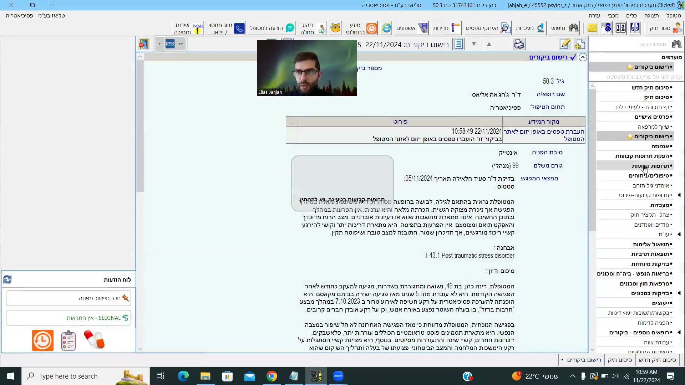

After signing, the visit record shows the full clinical text with timestamps:

**Visit metadata:**
- רישום ביקורים (Visit registration)
- Date: 22/11/2024
- Timestamp: 10:58:49 22/11/2024
- הטבעת טפסים באופן יום לאחר המטופל (Form stamping one day after patient)

**Clinical text visible:**
Full narrative of the psychiatric consultation including:
- Patient history and presenting complaints
- Examination findings
- Diagnosis: F43.1 Post-traumatic stress disorder
- Treatment plan
- Medication recommendations

**Top alert bar (highlighted in yellow):**
- "תשובות טפסים באופן יום לאחר לטופל יעצי..." — Form responses stamped the day after

---

### 3.8 Prescription Management

#### Step 16: Chronic Medications View (תרופות קבועות)
**Screenshot:** `16_chronic_medications_view.jpg`

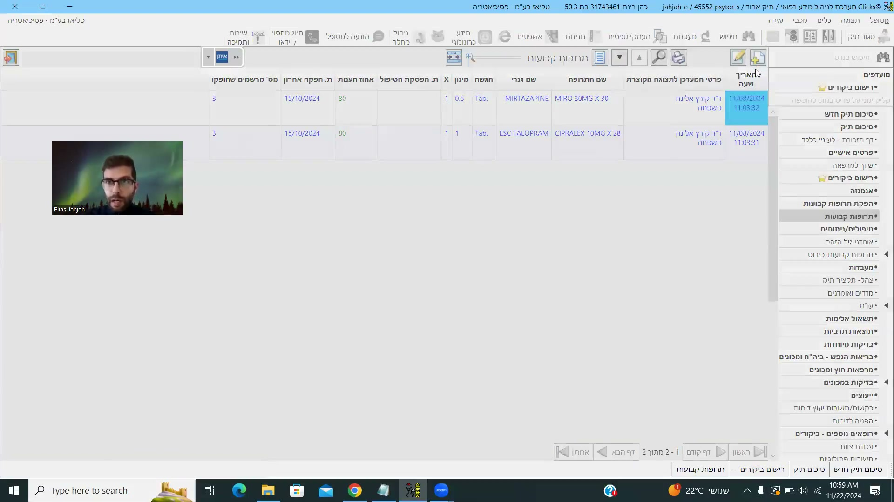

The chronic medications screen showing the current prescription status:

| Medication | Generic | Dosage | Frequency | Strength | Last Prescription | Prescriber | Date |
|-----------|---------|--------|-----------|----------|-------------------|-----------|------|
| MIRTAZAPINE | MIRO 30MG X 30 | 1 | 0.5 | Tab. | 80 | ד"ר קורץ אלינה - משפחה | 11/08/2024 11:03:32 |
| ESCITALOPRAM | CIPRALEX 10MG X 28 | 1 | 1 | Tab. | 80 | ד"ר קורץ אלינה - משפחה | 11/08/2024 11:03:31 |

**Columns visible:**
פרטי המעודכן לתצוגה מקוצרת | שם התרופה | שם גנרי | הגשה | מינון | X | ת. הפסקת הטיפול | אחוז הענות | ת. הפקה אחרון | מס' מרשמים שהופקו

**Navigation tabs at bottom:**
- סיכום תיק חדש | סיכום תיק | רישום ביקורים | תרופות קבועות (active)

---

#### Step 17: Medication Dosage Update
**Screenshot:** `17_medication_dosage_update.jpg`

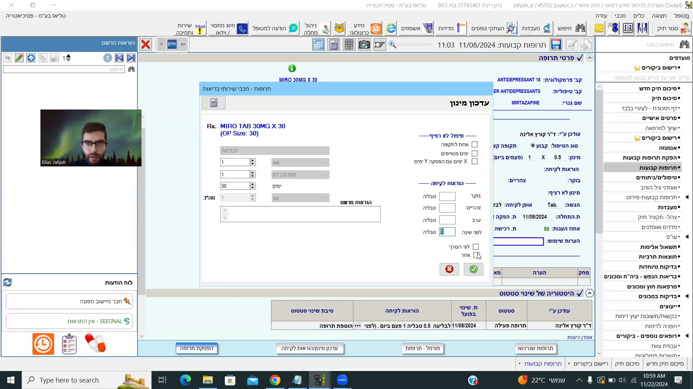

The medication details screen showing MIRO 30MG update:

**Prescription header:**
- הוראות מרשם (Prescription instructions)
- תרופות – מכבי שירותי בריאות (Medications – Maccabi Health Services)
- MIRO 30MG X 30 | ANTIDEPRESSANT 18
- ER ANTIDEPRESSANTS | MIRTAZAPINE

**Dosage update dialog (עדכון מינון):**
- Rx: MIRO TAB 30MG X 30 (OP Size: 30)
- כבלעיה (Swallow)
- Tab format
- 1 tablet, 1 time per day
- 30 days
- סה"כ: 1 (Total: 1)
- op format

**Taking instructions (הוראות לקיחה):**
- טבליה (Tablet): בוקר (Morning), צהריים (Afternoon), ערב (Evening), לפני שינה (Before sleep)

**Dispensing history (היסטוריה של שינויי סטטוס):**
- Status change log with dates

**Bottom section:**
- הפסקת תרופה (Discontinue medication)
- עדכון מינון/הוראות לקיחה (Update dosage/taking instructions)
- תרופות שנרכשו (Purchased medications)
- פורטל-תרופות (Medication portal)

**Data fields for API — Medication WRITE:**
| Field | Type | Notes |
|-------|------|-------|
| Drug name | String | MIRO TAB 30MG X 30 |
| Dosage | Decimal | Number of tablets |
| Frequency | Integer | Times per day |
| Duration | Integer | Days |
| Administration time | Enum | Morning/Afternoon/Evening/Before sleep |
| OP Size | Integer | Package size |
| Instructions | Free text | הוראות מרשם |

---

#### Step 18: New Prescription — Drug Search
**Screenshot:** `18_new_prescription_drug_search.jpg`

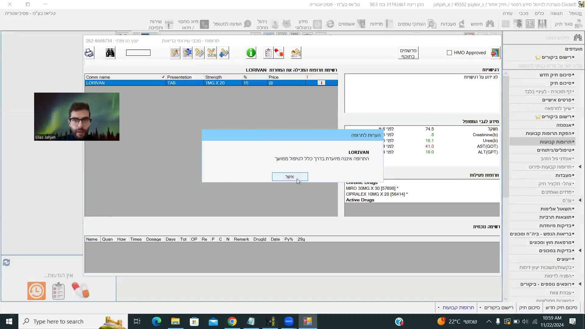

Adding a new prescription — the drug search screen shows:

**Drug search result for "LORIVAN":**
- LORIVAN TAB 1MG X 20 — showing in the drug list
- Drug details: Presentation: TAB, Strength: 1MG X 20, %: 15, Price: @

**Warning popup:** "LORIVAN — התרופה אינה מיועדת בדרך כלל לטיפול ממושך" (LORIVAN — this medication is not generally intended for prolonged treatment)

**Right panel — Patient information (מידע לגבי המטופל):**
| Lab test | Value | Date |
|----------|-------|------|
| משקל (Weight) | 74.5 | לפני 6 ש |
| Creatinine(b) | .8 | לפני 25 ש |
| Urea(b) | 16.1 | לפני 25 ש |
| AST(GOT) | 41.0 (↑) | לפני 14 ש |
| ALT(GPT) | 16.0 | לפני 14 ש |

**Active drugs panel:**
- Chronic Drugs: MIRO 30MG X 30 [57698]*, CIPRALEX 10MG X 28 [56414]*
- Active Drugs: (section visible)

**Prescription table columns:**
Name | Quan | How | Times | Dosage | Days | Tot | OP | Re | P | C | N | Remark | DrugId | Date | Py% | 29g

---

#### Step 19: Prescription Form — Dosage & Instructions
**Screenshot:** `19_prescription_form_dosage_instructions.jpg`

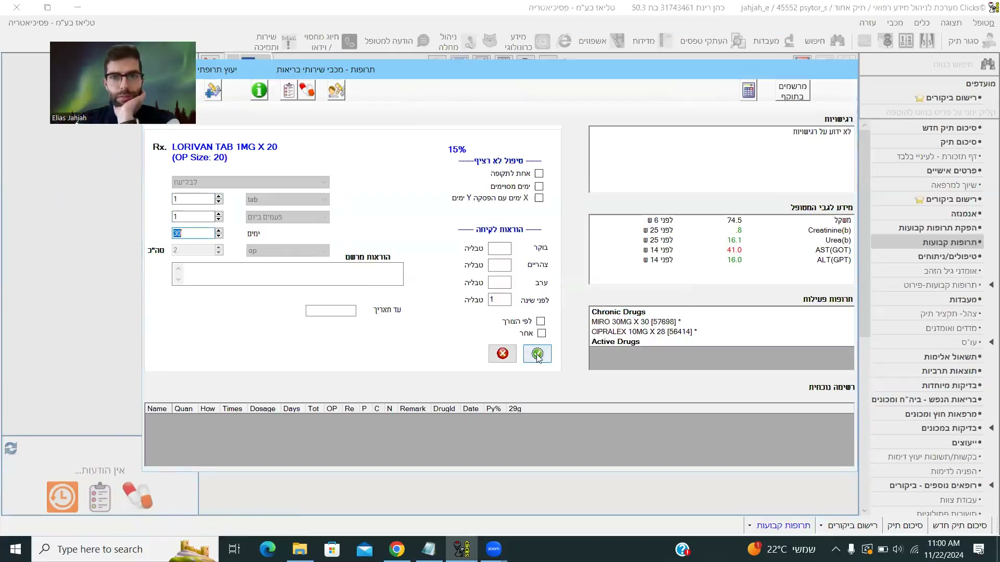

The prescription entry form for LORIVAN:

**Drug details:**
- Rx: LORIVAN TAB 1MG X 20 (OP Size: 20)
- 15% co-pay indicator

**Dosage configuration:**
- כבלעיה (Swallow)
- 1 Tab
- 1 time per day
- 20 days
- סה"כ: 2 (Total: 2)
- op format

**Treatment type: טיפול לא רציף (Non-continuous treatment)**
- Options: אחת לתקופה (Once per period), ימים מסויימים (Specific days), X ימים עם הפסקה Y ימים (X days with Y days break)

**Taking instructions:**
- לפני שינה: 1 טבליה (Before sleep: 1 tablet)

---

#### Step 20: Prescription Save Confirmation
**Screenshot:** `20_prescription_save_confirmation.jpg`

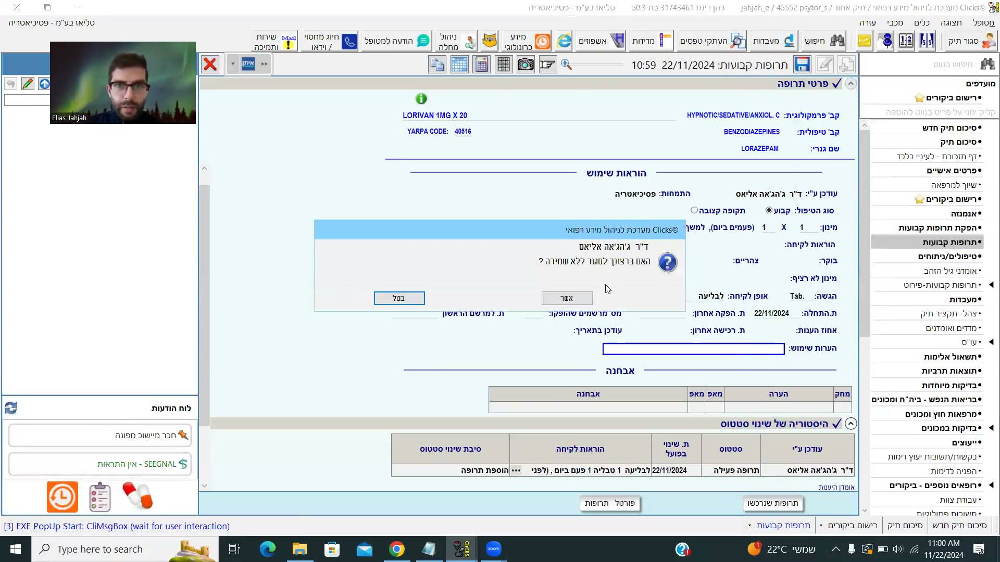

The save confirmation dialog:
- **Drug:** LORIVAN 1MG X 20
- **Classification:** HYPNOTIC/SEDATIVE/ANXIOL C
- **YARPA CODE:** 40516
- **Category:** BENZODIAZEPINES
- **Generic:** LORAZEPAM

**Usage instructions (הוראות שימוש):**
- עדכון ע"י: ד"ר ג'הג'אה אלי'אס
- התמחות: פסיכיאטריה
- סוג הטיפול: קבועה (Chronic)
- Clicks מערכת לניהול רפואי: ☑
- תקופה קבועה / תקופה קבועה (Fixed period)

**Confirmation:** "ד"ר ג'הג'אה אלי'אס — האם ברצונך לסגור ללא שמירה?" (Do you want to close without saving?)

---

#### Step 21: Prescription Generation (הפקת מרשמים)
**Screenshot:** `21_prescription_generation_screen.jpg`

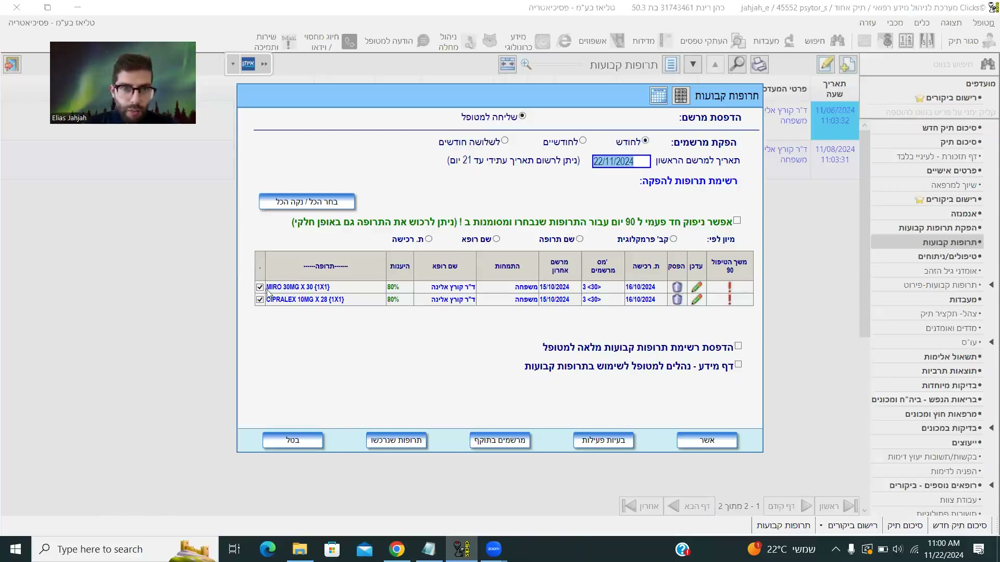

The prescription generation screen for chronic medications:

**Output options:**
- הדפסת מרשם (Print prescription) ☑ / שליחה למטופל (Send to patient)
- Duration: לחודש (Monthly) / לחודשיים (Bi-monthly) / לשלושה חודשים (Quarterly)
- אפשר ניפוק חד פעמי ל 90 יום (Allow one-time 90-day dispensation)

**First prescription date:** 22/11/2024
- ניתן לרשום תאריך עתידי עד 21 יום (Can set future date up to 21 days)

**Medication selection table:**
| Medication | Adherence | Prescriber | Last Prescription | Num. Prescriptions | Status | Last purchase |
|-----------|-----------|-----------|-------------------|-------------------|--------|---------------|
| ☑ MIRO 30MG X 30 (1X1) | 80% | ד"ר קורץ אלינע | משפחה | 15/10/2024 | 3 | <30> | 16/10/2024 |
| ☑ CIPRALEX 10MG X 28 (1X1) | 80% | ד"ר קורץ אלינע | משפחה | 15/10/2024 | 3 | <30> | 16/10/2024 |

**Additional options:**
- הדפסת רשימת תרופות קבועות מלאה למטופל (Print full chronic medication list for patient)
- דף מידע - נהלים למטופל לשימוש בתרופות קבועות (Info sheet — guidelines for chronic medication use)

**Action buttons:**
- ביטול (Cancel)
- תרופות שנרכשו (Purchased medications)
- מרשמים בתוקף (Active prescriptions)
- בעיות פעילות (Active issues)
- אשר (Approve)

**Data fields for API — Prescription generation WRITE:**
| Field | Type | Notes |
|-------|------|-------|
| Prescription duration | Enum | Monthly/Bi-monthly/Quarterly |
| First prescription date | Date | |
| Medication list | Array | Selected medications |
| Send to patient | Boolean | Digital delivery |
| 90-day dispensation | Boolean | Single dispensation option |

---

### 3.9 External System — Summary Document

#### Step 22: Google Docs Summary (External to Clicks)
**Screenshot:** `24_google_docs_summary_document.jpg`


This screenshot shows the **Taliaz side** of the workflow — a summary document being prepared in Google Docs (`docs.google.com/document/d/1Tyogc2ia6ynBad9j_qnoKCV2JtYNqOqt/edit`) before being manually copy-pasted into Clicks.

**Visible content (Hebrew RTL):**
- Clinical narrative describing symptoms, examination findings
- Section: "תרופות מומלצות" (Recommended medications):
  1. המשך נטילת ציפרלקס 10 מ"ג פעם ביום (Continue Cipralex 10mg once daily)
  2. העלאת מינון מירו ל-30 מ"ג בערב (Increase Miro to 30mg evening)

**Integration note:** This is the **exact content** that should be pushed automatically from Taliaz to Clicks via API, eliminating the copy-paste workflow between Google Docs → Clicks תשובת יועץ.

---

## 4. Data Flow Summary — Fields Requiring API Access

### 4.1 READ Operations (Clicks → Taliaz)

| Priority | Data | Clicks Screen | Current Method |
|----------|------|--------------|----------------|
| HIGH | Patient demographics | פרטים אישיים | Manual lookup |
| HIGH | Known diagnoses | בעיות ידועות | Manual reading |
| HIGH | Current medications | תרופות קבועות | Manual reading |
| HIGH | Allergies | רגישויות | Manual reading |
| MEDIUM | Lab results | מעבדות | Manual reading |
| MEDIUM | Previous consultations | ייעוצים | Manual reading |
| LOW | Risk factors | גורמי סיכון | Manual reading |

### 4.2 WRITE Operations (Taliaz → Clicks)

| Priority | Data | Clicks Screen | Current Method |
|----------|------|--------------|----------------|
| **CRITICAL** | Consultant response letter | תשובת יועץ | Copy-paste from Google Docs |
| HIGH | Visit registration | רישום ביקורים | Manual entry |
| HIGH | Diagnosis | אבחנה | Manual ICD search |
| HIGH | Treatment plan | תוכנית טיפול | Manual text entry |
| HIGH | New prescriptions | תרופות קבועות | Manual drug search |
| HIGH | Dosage updates | עדכון מינון | Manual entry |
| MEDIUM | Follow-up scheduling | מוזמן למעקב | Manual selection |
| MEDIUM | Digital signature | חתימה דיגיטלית | Manual login |

---

## 5. Integration Considerations

### 5.1 Known Constraints
1. **Citrix layer**: Clicks runs inside Citrix, adding a virtualization layer between the client and server
2. **Digital signatures**: Visit completion requires username/password authentication for legal signing
3. **Drug interaction checks**: Clicks performs real-time drug interaction validation during prescription entry
4. **HMO approval workflows**: Some medications require prior HMO approval (אישור תרופות)
5. **Previous API assessment**: In September 2025, Elias Jahjah reported that Maccabi/Clicks teams stated API was not possible. This assessment should be revisited with the Bat Kol project context.

### 5.2 Bat Kol Project (Potential API Source)
During the meeting on March 19, 2026, it was mentioned that Maccabi's **Bat Kol project** already has an API for uploading summaries into Clicks fields. This existing API infrastructure could potentially be reused for Taliaz's integration needs, specifically:
- Uploading consultant response letters (תשובת יועץ)
- Pushing diagnosis codes
- Writing treatment plans

### 5.3 Kasefet (כספת) — Existing Upload Mechanism
Taliaz previously attempted to use the Kasefet mechanism for uploading summaries. The issue was routing — summaries were uploaded but didn't reach the family doctor or patient. The configuration needs to be revisited to ensure proper routing of the תשובת יועץ to the correct recipients.

### 5.4 Security & Access Requirements
- All data exchange must comply with Israeli Privacy Protection Authority (PPA) regulations
- VPN access from non-Israeli locations requires special InfoSec approval
- Locked laptops are mandatory for Clicks access
- Service account authentication may be required for automated API access

---

## 6. Recommended Integration Phases

### Phase 1: Summary Upload (Highest ROI)
- Target: Automate תשובת יועץ upload from Taliaz → Clicks
- Approach: Investigate Bat Kol API reuse, or Kasefet configuration fix
- Estimated impact: Eliminates ~5-10 minutes of copy-paste per consultation

### Phase 2: Patient Data Pull
- Target: Auto-populate Taliaz patient record with Clicks demographics, medications, diagnoses
- Approach: Read-only API access to patient file
- Estimated impact: Eliminates manual data entry and reduces errors

### Phase 3: Prescription Integration
- Target: Issue prescriptions from Taliaz interface reflected in Clicks
- Approach: Write API to תרופות קבועות module
- Estimated impact: Most complex due to drug interaction checks and digital signature requirements

---

## 7. Appendix: Screenshot Index

All screenshots are stored in `./maccabi-spec-screenshots/` directory.

| # | Filename | Description | Clicks Screen |
|---|----------|-------------|---------------|
| 01 | `01_citrix_storefront_app_launcher.jpg` | Citrix StoreFront portal | Citrix ExtWeb |
| 02 | `02_clicks_doctor_portal_patient_list.jpg` | Doctor portal with patient list | פורטל רופא |
| 03 | `03_clicks_and_predictix_side_by_side.jpg` | Split view Clicks + Taliaz | Dual system |
| 04 | `04_patient_file_personal_details.jpg` | Patient demographics & clinical data | פרטים אישיים |
| 05 | `05_visit_registration_screen.jpg` | Opening a new visit | רישום ביקורים |
| 06 | `06_clinical_findings_form.jpg` | Clinical examination categories | ממצאי הבדיקה |
| 07 | `07_diagnosis_icd_entry.jpg` | ICD diagnosis autocomplete | אבחנה |
| 08 | `08_treatment_type_psychiatric_codes.jpg` | Psychiatric service codes | טיפולים |
| 09 | `09_consultant_response_doctor_selection.jpg` | Referring doctor selection | תשובת יועץ |
| 10 | `10_consultant_response_letter_content.jpg` | Full consultant response letter | תשובת יועץ |
| 11 | `11_summary_diagnosis_recommendations.jpg` | Diagnosis & treatment recommendations | תשובת יועץ |
| 12 | `12_visit_completion_treatment_code.jpg` | Treatment code & follow-up | רישום ביקורים |
| 13 | `13_form_submission_patient_instructions.jpg` | Form submission dialog | חתימה ושליחה |
| 14 | `14_digital_signature_login.jpg` | Digital signature authentication | חתימה דיגיטלית |
| 15 | `15_signed_visit_record.jpg` | Signed visit with clinical text | רישום ביקורים |
| 16 | `16_chronic_medications_view.jpg` | Chronic medications table | תרופות קבועות |
| 17 | `17_medication_dosage_update.jpg` | Dosage update dialog | עדכון מינון |
| 18 | `18_new_prescription_drug_search.jpg` | Drug search with warnings | תרופות |
| 19 | `19_prescription_form_dosage_instructions.jpg` | Prescription form details | תרופות |
| 20 | `20_prescription_save_confirmation.jpg` | Save confirmation dialog | תרופות |
| 21 | `21_prescription_generation_screen.jpg` | Prescription generation | הפקת מרשמים |
| 22 | `22_drug_catalog_medication_list.jpg` | Full drug catalog | תרופות |
| 23 | `23_updated_medications_after_prescription.jpg` | Updated medication list | תרופות קבועות |
| 24 | `24_google_docs_summary_document.jpg` | External summary in Google Docs | External system |

---

*Document generated from screen recording by Elias Jahjah (November 22, 2024) demonstrating the full Clicks EHR workflow for Taliaz/HealthyMind psychiatric consultations.*
