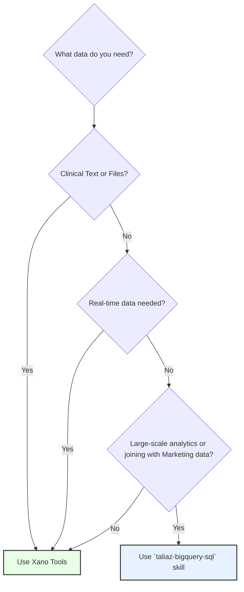

---
alfred_tags:
- taliaz/reporting
- clinic-analytics
description: 'Definitive skill for querying the Taliaz HealthyMind Xano clinical database.
  Provides workflows, query patterns, and references for accessing the live transactional
  backend. Use this skill for any task requiring real-time patient data, clinical
  notes, meeting transcripts, summaries, or patient files. This is the source of truth
  for clinical content. Triggers on: find patient data, get meeting transcript, pull
  clinical notes, what happened in the meeting with..., access Xano data, query the
  clinical backend, get patient files, read summary for meeting X.'
name: taliaz-xano-data
---

# Taliaz Xano Clinical Data Skill

This skill provides the definitive guidance for querying the live Taliaz HealthyMind clinical database via the Xano MCP server. It contains the necessary context, workflows, and query patterns to access the source of truth for all clinical operations.

## 1. Core Principle: Xano is the Source of Truth

- **Xano is the LIVE transactional backend**. It contains real-time data.
- **BigQuery (`XanoView`) is a lagged, incomplete MIRROR**. It is useful for large-scale analytics but lacks the most critical clinical content.
- **THE KEY DIFFERENCE**: Xano contains the actual **text content** (clinical notes in `meeting_texts`) and **file content** (transcripts, summaries, prescriptions). BigQuery's corresponding fields are either empty or contain only file references (UUIDs).

## 2. Decision Guide: Xano vs. BigQuery

**ALWAYS START WITH THIS DECISION TREE.**



| Use Case | Recommended Tool/Skill | Justification |
|---|---|---|
| **Accessing ANY text content** (transcripts, summaries, clinical notes) | **This Skill (Xano Tools)** | Only Xano has the actual content. |
| **Retrieving ANY patient files** (summaries, prescriptions, uploads) | **This Skill (Xano Tools)** | Xano stores the files; its tools provide access paths. |
| **Real-time data needs** (e.g., status of a meeting that just ended) | **This Skill (Xano Tools)** | Xano is the live database. BQ can be delayed. |
| **Large-scale analytics & aggregations** (e.g., patient counts by clinic over a year) | `taliaz-bigquery-sql` | BigQuery is optimized for complex, large-scale SQL. |
| **Joining clinical and marketing (HubSpot) data** | `taliaz-bigquery-sql` | The `DWH` dataset in BQ contains the marketing data. |

## 3. The Xano Query Process

Follow this process for every Xano query.

1.  **Identify the Core Entity**: What is the main subject? (e.g., a Patient, a Meeting, a Therapist).
2.  **Consult the Schema**: Read `references/schema.md` to find the right table and column names.
3.  **Find the Record ID**: Use `xano_search_table` with filters to find the specific record(s) you need and get their `id`.
4.  **Retrieve Full Data**: Use `xano_get_record` with the `id` for a single record, or `xano_browse_table` for multiple.
5.  **Follow Relationships**: If you need related data (like notes for a meeting), use the ID you found to search the related table (e.g., search `meeting_texts` using the `meeting_id`).

## 4. Common Workflows & Query Patterns

These are the most frequent tasks you will perform.

### Workflow 1: Get Clinical Notes for a Meeting

This is the most important workflow. The clinical narrative is in `meeting_texts`.

1.  **Find the Meeting ID**: Search the `Meeting` table for the patient and date.
2.  **Search `meeting_texts`**: Use the `meeting_id` to query the `meeting_texts` table.
3.  **Assemble the Narrative**: The result will be multiple rows, one for each clinical section (`HPI`, `PsychiatricHistory`, etc.). The `text` column holds the content.

**Example**: Get notes for Meeting ID `5678`.
```json
{
  "brief": "Get all clinical note sections for meeting 5678",
  "tool_name": "xano_search_table",
  "input": {
    "params": {
      "table": "meeting_texts",
      "search": [
        {
          "column": "meeting_id",
          "operator": "=",
          "value": 5678
        }
      ]
    }
  }
}
```

### Workflow 2: Get a Patient's Full Record

1.  **Find the Patient ID**: Search the `Patient` table by name, email, or `HM_ID`.
2.  **Get the Record**: Use `xano_get_record` with the `Patient` table and the `id` you found.

**Example**: Get patient record for `Rami`.
```json
{
  "brief": "Find the patient ID for Rami",
  "tool_name": "xano_search_table",
  "input": {
    "params": {
      "table": "Patient",
      "search": [
        {
          "column": "first_name",
          "operator": "contains",
          "value": "Rami"
        }
      ]
    }
  }
}
```

### Workflow 3: Get a Meeting Transcript

Full transcripts are often stored in the `summary_runs` table.

1.  **Find the Meeting ID**.
2.  **Search `summary_runs`**: Use the `meeting_id` to find the corresponding AI processing log.
3.  **Extract the Text**: The `transcript` column in the `summary_runs` result usually contains the full transcript text.

## 5. Reference Library

This skill includes a library of reference files. **Consult them before querying** to ensure you are using the correct tables, columns, and values.

| Reference File | Purpose |
|---|---|
| `references/schema.md` | **Primary Schema Reference**. Detailed breakdown of the most important tables (`Patient`, `Meeting`, `meeting_texts`, etc.) and their key columns. |
| `references/enums.md` | **Critical for Filtering**. Lists the possible values for all key status and type fields (e.g., `Patient.status`, `Meeting.status`, `user.role`). |
| `references/cookbook.md` | **Query Examples**. A collection of ready-to-use query patterns for common requests (e.g., "find patient's last meeting", "list all of a doctor's patients"). |
| `references/tools.md` | **Tool Documentation**. Detailed explanation of the Xano MCP tools and their parameters. |